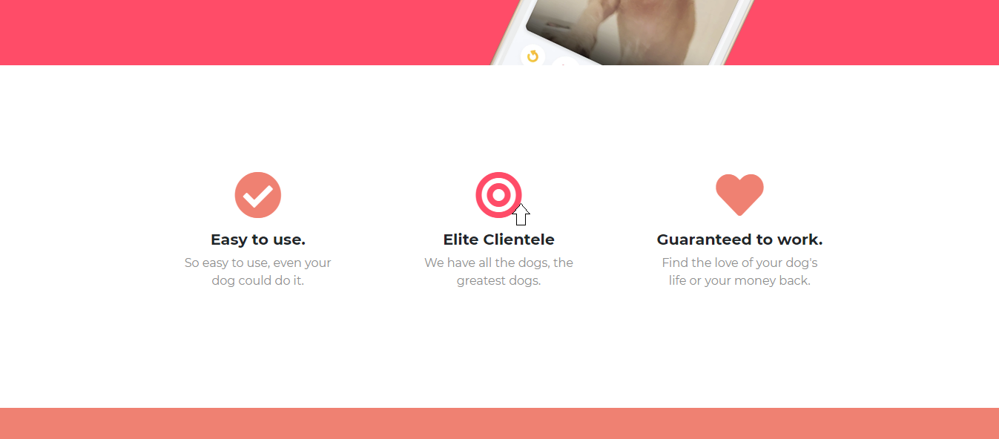
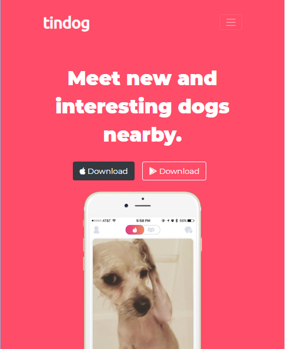

# tindog
This is my third project for web development course. The project is based on Angela Yu's Complete Web Development Course's 3rd project tindog site. The project focuses on learning and implementing basic bootstrap.

## Live Link:

## Desktop View:
### Title Section-

### Features Section-

### Testimonials Section-

### Footer Section-

## Mobile View:
### Title Section-

### Features Section-

### Testimonials Section-

### Footer Section-

## Deployment:
This project is deployed on github pages.

## Inspiration:
The inspiration for the websites have been taken from the follwing:
* [Angela Yu](https://github.com/angelabauer)'s Tindog Project following the same principles and code style. The starting files can be found [here](https://github.com/londonappbrewery/TinDog-Start).

## Acknowledgements:
I'd like to express my greatest gratitude towards [angelabauer](https://github.com/angelabauer) for her course at [udemy](https://www.udemy.com/course/the-complete-web-development-bootcamp/).
For the website I've used the following resources:
* ***Starting Template***: [LondonAppBrewery](https://github.com/londonappbrewery/TinDog-Start)
* ***Icons***: [FlatIcons](https://www.flaticon.com/)
* ***Fonts***: [GoogleFonts](https://fonts.google.com/)
